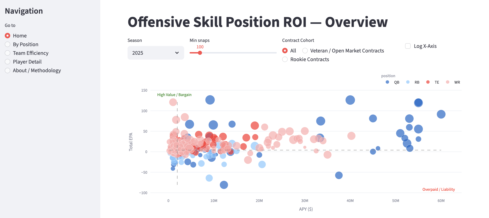
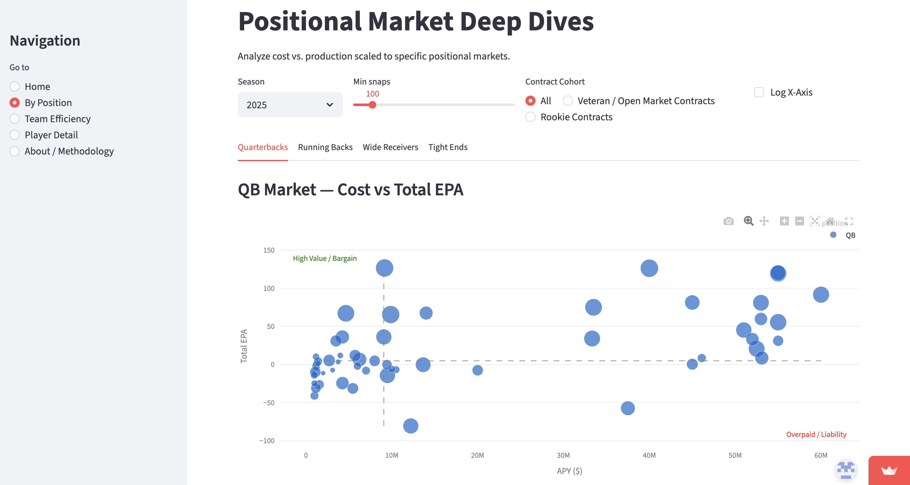
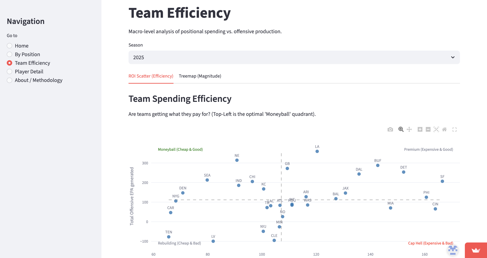

# NFL Roster ROI: Offensive Skill Position Contract Efficiency Analysis

This repository contains an end-to-end quantitative finance and sports analytics platform designed to evaluate the financial return on investment (ROI) of NFL offensive skill positions — quarterback (QB), running back (RB), wide receiver (WR), and tight end (TE).

By combining play-by-play production data and partial contract data from `nflreadpy`, the project builds a machine-learning-based pricing engine to identify market inefficiencies, estimate surplus value, and analyze front-office capital allocation strategies.

## Core Objectives

* **Quantify ROI:** Translate on-field statistical production into objective financial metrics.
* **Identify Market Inefficiencies:** Detect “Moneyball” assets whose production significantly outpaces their contract costs.
* **Expected APY Pricing Engine:** Use a five-year historical dataset to estimate a player’s true open-market value through regression modeling.
* **Multi-Dimensional Dashboards:** Deliver both macro-level team analysis and micro-level player analysis for general manager and front-office decision-making.

## Technology Stack

* **Language:** Python 3.12
* **Data Sources:** `nflreadpy` (play-by-play, rosters), OverTheCap (contracts)
* **Database:** Supabase (PostgreSQL) for longitudinal data storage (2021–2025)
* **Machine Learning:** Scikit-learn, Pandas, NumPy
* **Visualization:** Streamlit, Plotly
* **CI/CD & Automation:** GitHub Actions for ETL automation

## Directory Structure

```text
nfl-roster-roi/
├── .github/workflows/      # GitHub Actions automation scripts
├── artifacts/              # Local data snapshots (CSV)
├── etl/                    # ETL pipeline: API extraction to Supabase insertion
│   ├── database.py         # Supabase client and upsert logic
│   └── etl.py              # Main task flow and data sanitization
├── infra/                  # Database DDL and schema definitions
├── notebooks/              # R&D: model selection and statistical diagnostics
├── src/                    # Core calculation engine
│   ├── analysis.py         # ROI computation and roster resolution logic
│   └── stats_helpers.py    # EPA and production aggregation utilities
└── streamlit_app/          # Frontend visualization application
    ├── components/         # Shared UI components and charting functions
    └── views/              # Application pages (Home, Player, Team, Position)
```

## Model Methodology: Expected APY Engine

The project uses isolated five-variable Ridge Regression models for each offensive position to predict open-market value. The architecture follows these statistical principles:

### 1. Target Variable Normalization

The model predicts `log1p(cap_pct_of_team * 100)`. By modeling salary-cap share rather than raw dollars, the algorithm neutralizes NFL salary cap inflation between 2021 and 2025.

### 2. Feature Matrix

* `total_epa`: Core measure of value generated (Expected Points Added)
* `snaps`: Field availability and usage volume
* `epa_per_snap`: Production efficiency
* `age`: Player age
* `years_exp`: Years of experience, capturing aging-curve dynamics and CBA-related leverage effects

### 3. Strict Training Protocol

The model is trained exclusively on veteran open-market contracts to learn unconstrained market pricing. It is then used to score the entire league, allowing direct comparison between rookies and veterans.

### 4. Statistical Validation

The modeling pipeline uses `GroupKFold` cross-validation grouped by `gsis_id` to prevent longitudinal leakage and ensure out-of-sample predictive validity.

## Key Features

* **Overview:** High-level scatter plots comparing EPA and contract APY to quickly identify high-value, low-cost players.
* **Position Deep Dives:** Position-specific market curves for QBs, RBs, WRs, and TEs.
* **Team Efficiency:** Macro-level analysis of how franchises allocate salary-cap space relative to positional output.
* **Player Dossier:** Detailed player profiles with historical time-series tracking across seasons and teams.

## Interactive Dashboard Preview

Explore the live application:

🔗 [Live Streamlit Dashboard](https://nfl-roster-roi-g3ufrcpghavld9jpvwpnvj.streamlit.app/)

### Player Valuation & Surplus Value Engine



### Position-Specific Market Curves



### Team-Level Contract Efficiency Analysis



## Installation and Deployment

### 1. Clone the repository

```bash
git clone https://github.com/samfan-27/nfl-roster-roi.git
cd nfl-roster-roi
```

### 2. Environment configuration

Create a `.env` file in the project root and configure your Supabase credentials:

```env
SUPABASE_URL=your_supabase_url
SUPABASE_SERVICE_ROLE_KEY=your_service_role_key
```

### 3. Install dependencies

```bash
pip install -r requirements.txt
```

### 4. Launch the dashboard

```bash
streamlit run streamlit_app/app.py
```

## Automated ETL Pipeline

This repository uses GitHub Actions to keep data current. On scheduled runs or manual dispatch, the pipeline:

1. Extracts the latest play-by-play and roster data via `nflreadpy`
2. Applies data sanitization, including filtering players without valid NFL `gsis_id`s
3. Recomputes EPA and ROI metrics
4. Performs incremental database updates using `on_conflict='season,gsis_id'` through the Supabase REST API
